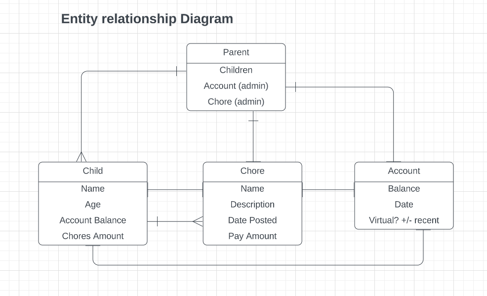

# Chore-Tracker (Kids piggy bank)

The Kids piggy bank app (or Chore Tracker, or PigMint-play off piggy bank + Mint financial app for adults) brings together two issues that are hard for parents AND kids to track on a daily/weekly basis. The piggy bank of the past is an outdated concept. Kids would push cash and change in a real piggy bank. Every few months they would dump this all out and organize only to count the amount at that moment, then return the money to the piggy bank. After a while they would get a bank account in their parents name. But the accounts for kids under 16 dont allow for easy visibility, deposits, or withdrawals. Many of these tasks are still on the parents to administer.

This app would solve many of those issues. The app would clearly show a child how much is in their bank, digitally. It would be an easy website/app for the kids to log into with very little friction on username/password. They could see current amount and possibly history of how it has grown. They will also see how they can increase the amount, thru chores. They will have a list of chores to choose from, or be able to make their own. Each chore will have an assigned dollar amount. When a child does one of these chores successfully, they will see the money added to their piggy bank. They have the ability to make up their own chores and negotiate the amount with their parents. They also have some way to prove that they did the chore, thru timestamps and/or pictures.

This app provides parents and children an EASY way to see current piggy bank amounts, but to also encourage chores done in the house. This can ultimately help children to build up the account, encourage saving, and give them much needed financial education in their early years.

## User stories

- As a user, I want to be able to - Create my own account
- As a user, I want to be able to - Choose from a list of standard chores I can do (ex. fold laundry, clean room, etc)
- As a user, I want to be able to - See how much each chore is worth
- As a user, I want to be able to - How much I currently have in my piggy bank
- As a user, I want to be able to - Create my own chore that is not on the list, and propose a price (ex. rake the leaves, organize the closet, etc)
- As a user, I want to be able to - Negotiate with my parents on how much a chore is worth (very similar to comments)
- As an admin user (parent), I want to be able to - Enter the current bank account balance and increase/decrease depending on chores done or money spent (spending might be bonus)
- As an admin user (parent), I want to be able to - Approve chores that were done thru comments or check marks
- As an admin user (parent), I want to be able to - Negotiate amounts on chores that children build themselves
- As an admin user (parent), I want to be able to - Ask for proof of a chore being done and see timestamps of when they were finished
- As an admin user (parent), I want to be able to - Make sure that only my kids can choose me as parent/admin (allow for other parent/child relationships on app)

### Bonus features

- As a user, I want to be able to - Immediately see my bank account current balance when I finish a chore
- As a user, I want to be able to - Set a goal or savings target for myself and see progres toward the goal
- As a user, I want to be able to - See my history of doing chores, what I have done, for how much
- As a user, I want to be able to - Post a picture of the chore I did as proof (Cloudinary)
- As a user, I want to be able to - How much my bank amount has gone up or down in the past (weeks/months/years)

## Wireframes

### Splash Page

### Account History

### Chores Available

### Create Chore

### Messages

### Completed Chore

## Entity Relationship Diagram

## Technologies used

- HTML
- CSS (Materialize)
- PYTHON
- DJANGO
- AWS - S3

[def]: ERD.png